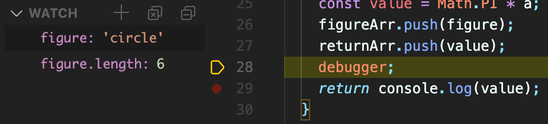
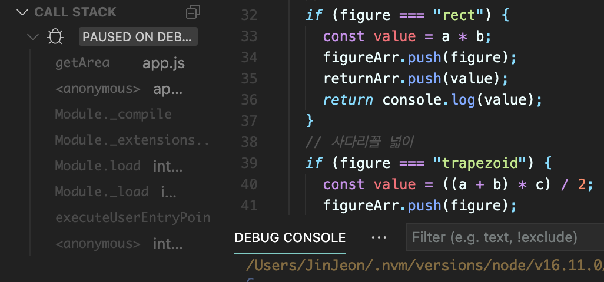

# DEBUGGING

Visual Studio Code 기준으로,

1. F5 입력 → Node.js 클릭
2. Run 버튼 → create a launch.json file → Select Environment → Node.js
   이 두 방법을 통해 debugging 창으로 넘어갈 수 있음

## 1. BREAKPOINT

중단점을 설정하여 지정한 위치에서 스크립트의 동작을 멈추고 디버깅이 가능하도록 하는 도구

1. 코드에 ‘debugger’ 추가 → debugger; 코드 위에 존재하는 변수에 대해서 어떠한 값이 받아졌는지를 확인할 수 있음

```javascript
returnArr.push(value);
debugger;
return console.log(value);
```

2. VSC에서 코드의 숫자 옆 공백을 클릭, 또는 F9 버튼 누를 시 빨간 점을 생성

## 2. WATCH

디버깅을 할 때 디버깅 중인 프로그램 안에 정의된 변수를 나타냄
변수의 타입, 길이 등 유효한 표현식은 무엇이든 추가가 가능함



## 3. CALL STACK

함수의 호출 정보가 쌓여있는 스택을 의미하며, function, method의 호출 순서가 표시됨  
LIFO 방식으로 동작하며, 프로그램의 흐름 파악에 도움을 줌


## 4-1. STEP OVER

하나의 statement 실행 후 일시 정지함  
단축키는 F10

## 4-2. STEP INTO

하나의 statement 실행 후 일시 정지하는 것은 같지만, 함수 호출이 있을 시 그 함수로 점프하고 첫 줄에서 일시정지함.  
단축키는 F11

## 4-3. STEP OUT

현재 진행 중인 함수의 나머지 부분을 모두 실행한 뒤 일시 중지함  
단축키는 Shift + F11

---

**코드 변경 시 [Ctrl + Shift + F5] 키로 재실행 후 진행**
